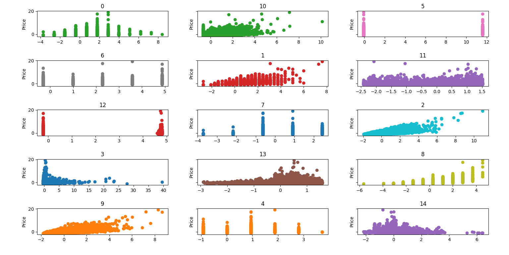
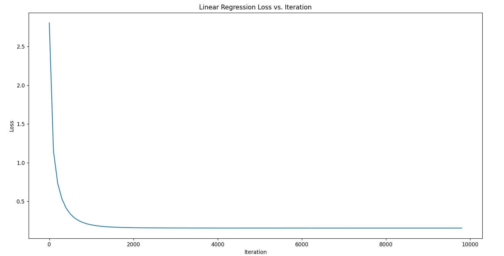

# Implementing a Regression Model for Housing Price Prediction
An attempt to improve personal knowledge of Regression models by implementing one to predict housing prices.
## Dataset

##### Normalized Dataset where the range of all columns is [-3, 3]

[king county housing prices](https://www.kaggle.com/datasets/harlfoxem/housesalesprediction) dataset from Kaggle.
columns in order shown in the image:
|               |                   |           |
|---------------|-------------------|-----------|
|bedrooms		|bathrooms 			|sqft_living|
|sqft_lot 		|floors 			|waterfront	|
|view			|condition 			|grade 		|
|sqft_above 	|sqft_basement 		|yr_built 	|
|yr_renovated 	|lat 				|long		|

## Training
##### the linear regression model is trained using Gradient Descent

Loss vs. Iteration graph over 10k iterations

## Evaluation
##### This implementation performed in comparison to the linear regression model provided by sci-kit learn library as follows:
Mean of Squared Error for Custom Model=>  37558185734.444756&ensp;
Mean of Squared Error for SKLEARN =>  37557177556.185135&ensp;
&ensp;
Root Mean Squared Percentage Error for Custom Model=>  34.70862548988226&ensp;
Root Mean Squared Percentage Error for SKLEARN =>  34.71202648861756&ensp;
## Code Sample
```
# training a model
regression_model = LR()
regression_model.train(train_X, train_Y)

# make predictions 
res = regression_model.predict(test_X)

# save trained model
regression_model.save_model("trained_model")

# load a pretrained model
regression_model = LR()
regression_model.load_model("trained_model")
````
