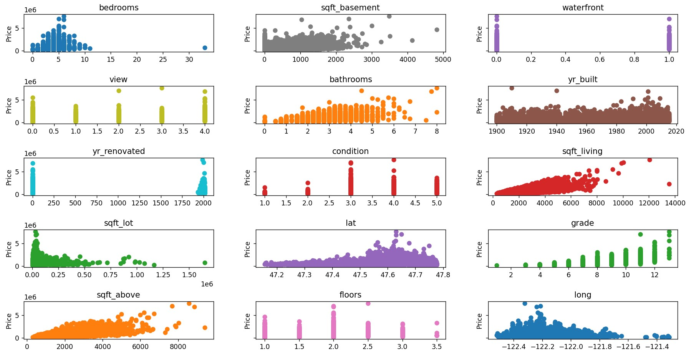

# Implementing a Regression Model for Housing Price Prediction
An attempt to improve personal knowledge of Regression models by implementing one to predict housing prices.
## Dataset
##### The initial dataset with several columns removed
['bedrooms' 'bathrooms', 'sqft_living', 'sqft_lot', 'floors',     'waterfront', 'view', 'condition', 'grade', 'sqft_above', 'sqft_basement', 'yr_built', 'yr_renovated', 'lat', 'long']
##### Normalized Dataset where the range of all columns is [-3, 3]
using Mean Normalization and MinMax Scaling

